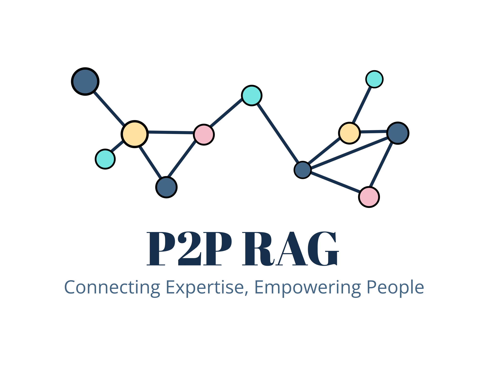
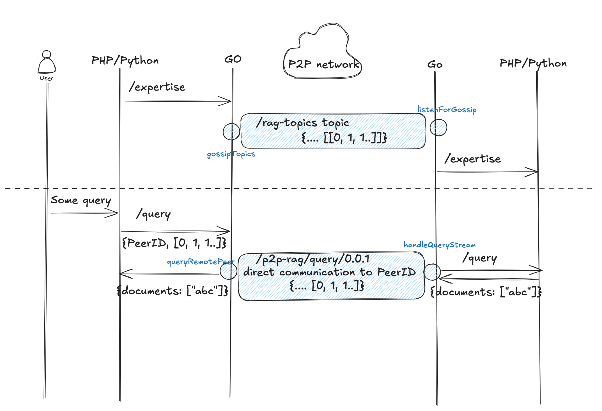

# Peer-to-Peer Federated RAG Framework



## About the Hackathon
See [project page](https://hackathon.cloudfest.com/project/peer-to-peer-federated-rag-framework/) for more details.

### General
Part of this code comes from the go-libp2p library, mainly from
its [examples](https://github.com/libp2p/go-libp2p/tree/master/examples/chat-with-rendezvous).

See also [edgevpn](https://github.com/mudler/edgevpn) for more hints.

## Setup notes for testing with 3 nodes

### In the root directory:

Change the rendezvous string and private keys in `docker-compose.yml` for the P2P Go nodes.

In the root directory, run `setup.sh` to setup the P2P Go nodes.

### In the `laravel-sherdoc` directory:

Seed the (shared) database using `sail artisan db:seed`.

Make sure you install the `nomic-embed-text` embedding model.

Run 3 commands (3 times, one for each node).

```
APP_SERVICE=laravel1.test sail artisan reverb:start & APP_SERVICE=laravel2.test sail artisan reverb:start & APP_SERVICE=laravel3.test sail artisan reverb:start

APP_SERVICE=laravel1.test sail artisan queue:work --timeout=900 & APP_SERVICE=laravel2.test sail artisan queue:work --timeout=900 & APP_SERVICE=laravel3.test sail artisan queue:work --timeout=900

APP_SERVICE=laravel1.test sail npm run dev & APP_SERVICE=laravel2.test sail npm run dev & APP_SERVICE=laravel3.test sail npm run dev
```

Go to `http://localhost:80/dashboard` (also for port `81` and `82`). Login and crawl & scrape contents (for 3 different sites).

Make sure all expertise topics are announced over the network. Force it again by visiting `http://localhost:80/api/announce` (also for port `81` and `82`).

Now you can start to ask questions in one of the chat dashboard interfaces.

## Documentation
### P2P Communcation Flow


#### First Flow
Starting in the project we first wanted to design the communication flow.


#### Exposure of new nodes / knowledge in the system
As soon as a new nodes joins the system, the nodes exposes its particular knowledge.


Defining the payload:


#### Querying the network
To query the network, the following flow should be implemented:


### Decisions
- Embeddings and vectors are used instead of plain text to ensure scalability.
